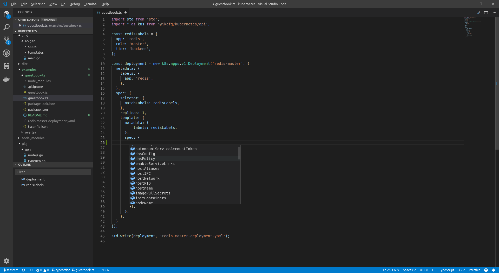

# A simple Kubernetes example

To run this example:

```console
# Install the required dependencies: `typescript`, `@jkcfg/kubernetes`, ...
$ npm install

# Transpile typescript to javascript
$ npx tsc

# Run jk on the resulting javascript
$ jk run -v guestbook.ts
wrote redis-master-deployment.yaml
```

`redis-master-deployment.yaml` should have been produced:

```yaml
apiVersion: apps/v1
kind: Deployment
metadata:
  labels:
    app: redis
  name: redis-master
spec:
  replicas: 1
  selector:
    matchLabels:
      app: redis
      role: master
      tier: backend
  template:
    metadata:
      labels:
        app: redis
        role: master
        tier: backend
    spec:
      containers:
      - image: redis
        name: master
        ports:
        - containerPort: 6379
        resources:
          requests:
            cpu: 100m
            memory: 100Mi
```

## Visual Studio Code support

Visual Studio Code supports typescript natively. `@jkcfg/kubernetes` provides
types for Kubernetes objects, allowing type-aware autocompletion and field
validation. For example this is vscode showing autocompletion for the
`PodSpec` object.


